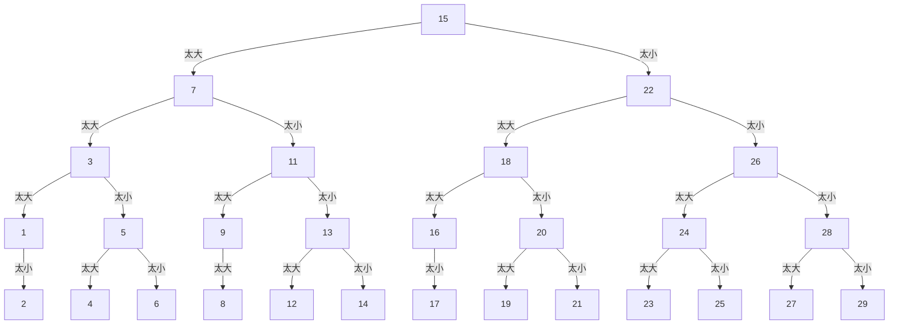

<center></center>
<!--more-->

# 简单查找
- 查找某个元素是否在数组（长度为$n$）中、或者在数组的哪个位置，挨个把数组的每个元素都找一遍，找到目标元素。最糟的情况下，需要找$n$次，运行时间为$O(n)$

以简单法猜1~30以内的数：
```mermaid
graph TD;
    1-->|太小|2;
    2-->|太小|3;
    3-->|太小|4;
    4-->|太小|5;
    5-->|太小|(...);
    (...)-->|太小|29;
    29-->|太小|30;
```

# 二分查找
- 一种算法
- 快速查找有序元素列表中的符合条件的元素

以二分法猜1~30以内的数：

$2^5=32>30$，最多只需要猜5步就好啦。


## 运行时间
- 对于包含$n$个元素的列表，用二分查找最多需要$\log_2{n}步$
- 二分查找的运行时间为**对数时间** $O(\log{n})$
- 而普通查找的运行时间为**线性时间** $O(n)$


```Python
import math

def binary_search(lst, item):
    """
    使用二分法找到元素item在列表lst中的索引
    lst中的元素已按从小到大排列
    """
    low, high = 0, len(lst) - 1
    
    while low <= high:
        mid = math.floor((low + high) / 2)
        guess = lst[mid]
        if guess == item:
            return mid
        if guess > item:  ## 猜大了
            high = mid - 1
        else:  ## 猜小了
            low = mid + 1
    return None
```
例子：
```Python
my_lst = [1, 3, 4, 5, 9]
print(binary_search(my_lst, 5))
## 3
print(binary_search(my_lst, 7))
## None
```


# 参考资料
- [图解算法](https://book.douban.com/subject/26979890/)

# 推荐阅读
- [GitHub-Fucking Algorithm-动态规划设计：最长递增子序列(二分查找解法)](https://labuladong.github.io/ebook/%E5%8A%A8%E6%80%81%E8%A7%84%E5%88%92%E7%B3%BB%E5%88%97/%E5%8A%A8%E6%80%81%E8%A7%84%E5%88%92%E8%AE%BE%E8%AE%A1%EF%BC%9A%E6%9C%80%E9%95%BF%E9%80%92%E5%A2%9E%E5%AD%90%E5%BA%8F%E5%88%97.html)
- [GitHub-Fucking Algorithm-二分查找详解](https://labuladong.github.io/ebook/%E7%AE%97%E6%B3%95%E6%80%9D%E7%BB%B4%E7%B3%BB%E5%88%97/%E4%BA%8C%E5%88%86%E6%9F%A5%E6%89%BE%E8%AF%A6%E8%A7%A3.html)