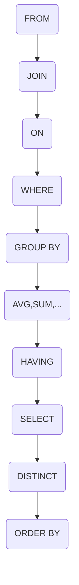

<center></center>
<!--more-->

# SQL语句执行顺序



- 所有的查询语句都是从`FROM`开始执行的
- 在执行过程中，每个步骤都会为下一个步骤生成一个虚拟表，该虚拟表将作为下一个执行步骤的输入

1. 执行`FROM`子句，生成虚拟表`vt1`(选择相对小的表做基础表)
2. 应用`ON`筛选器，`ON`中的逻辑表达式将应用到`vt1`中的各个行，筛选出符合条件的行，生成虚拟表`vt2`
3. 执行`JOIN`语句，添加
 - 如果是`OUTER JOIN`，则添加外部行
 - 如果是`LEFT OUTER JOIN`，则添加左表在第二步中过滤后得到的行
 - 如果是`RIGHT OUTER JOIN`，则添加右表在第二步中过滤后得到的行
 
 生成虚拟表`vt3`
4. 如果`FROM`子句中的表数目多于2个表，则将`vt3`和第三个表重复1~3的步骤，得到的虚拟表记为`vt3`；将`vt3`和第四个表重复1~3的步骤，得到的虚拟表记为`vt3`；……直到处理完`FROM`子句中的所有的表
5. 对虚拟表`vt3`应用`WHERE`筛选器，生成虚拟表`vt4`
6. `GROUP BY col_name`子句按`col_name`列聚合（`col_name`相同值为一组），得到虚拟`vt5`表
 - 如果应用了`GROUP BY`，则后面的步骤都只能得到`vt5`表的列或使用关于`vt5`表的列的聚合函数（`COUNT`,`SUM`,`AVG`等）
 - `GROUP BY`将列中唯一的值分成一组，同时只为每一组返回一行记录
7. Oracle特有：应用`CUBE`或`ROLLUP`选项，为`vt5`生成超组，得到虚拟表`vt6`
8. 应用`HAVING`筛选器，生成虚拟表`vt7`
 - `HAVING`是第一个也是唯一一个应用到已分组数据的筛选器
9. 处理`SELECT`子句，将虚拟表`vt7`中出现的列筛选出来，生成虚拟表`vt8`
10. 应用`DISTINCT`子句，移除`vt8`中相同的行，生成虚拟表`vt9`
 - 如果应用了`GROUP BY`子句，则`DISTINCT`子句是多余的
 - `GROUP BY`的效率比`DISTINCT`高
11. 应用`ORDER BY`子句，返回一个游标，而不是虚拟表
 - 是第一个也是唯一一个可以使用`SELECT`列表中别名的步骤
12. 应用`TOP`，将返回结果给请求者


以MySQL为例，写的SQL语句顺序为
```mysql
SELECT ... 
FROM ... JOIN ... ON ...
WHERE ...
GROUP BY ...
HAVING ...
ORDER BY ... 
LIMIT ... [OFFSET ...]
```
执行顺序
```sql
FROM ... JOIN ... ON ...
WHERE ... 
GROUP BY ...
HAVING ...
SELECT ...
ORDER BY ...
LIMIT ... [OFFSET ...]
```



## Oracle
Oracle中，在进行多列分组统计时，如果直接使用`GROUP BY`子句指定分组列，则只能生成基于所有分组列的统计结果。

如果在`GROUP BY`子句中使用`ROLLUP`语句或`CUBE`语句，除了生成基于所有指定列的分组统计外，还可以生成基于指定列不同子集的统计结果。

### CUBE
使用`CUBE`选项，除了生成基于所有指定列的分组统计外，还对指定分组列的所有子集进行统计


```sql
GROUP BY CUBE(A,B,C)
```

形成的统计包括以下内容：
- `GROUP BY`：不基于任何列的整个查询结果的统计
- `GROUP BY A`：基于A列的分组统计
- `GROUP BY B`：基于B列的分组统计
- `GROUP BY C`：基于C列的分组统计
- `GROUP BY A,B`：基于A、B两列的分组统计
- `GROUP BY A,C`：基于A、C两列的分组统计
- `GROUP BY B,C`：基于B、C两列的分组统计
- `GROUP BY A,B,C`：基于A、B、C三列的分组统计



### ROLLUP
使用`ROLLUP`选项，除了生成基于所有指定列的分组统计外，还对指定的分组列从左开始的每个子集进行统计。


```sql
GROUP BY ROLLUP(A,B,C)
```

形成的统计包括以下内容：
- `GROUP BY`：不基于任何列的整个查询结果的统计
- `GROUP BY A`：基于A列的分组统计
- `GROUP BY A,B`：基于A、B两列的分组统计
- `GROUP BY A,B,C`：基于A、B、C三列的分组统计



# 参考资料
- [关于sql和MySQL的语句执行顺序](https://www.cnblogs.com/yyjie/p/7788428.html)
- [oracle中分组中的ROLLUP和CUBE选项](https://www.cnblogs.com/wangyonglong/p/5140728.html)