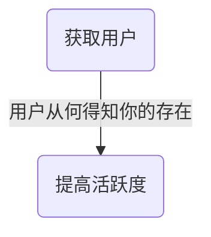
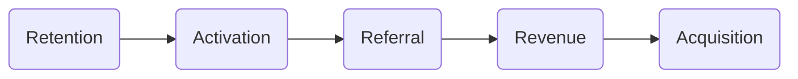

<!--more-->

# AARRR模型
**AARRR模型**是经典的用户分析模型，是一个典型的漏斗结构。

AARRR也称“海盗指标”，由风险投资人Dave McClure创造。Dave McClure将创业公司最需要关注的指标分为五大类：
- **Acquisition** 获取用户
- **Activation** 提高活跃度（激发活跃）
- **Retention** 提高留存率
- **Revenue** 获取营收
- **Referral** 自传播（传播推荐）

> 这五个指标并不一定遵守严格的先后顺序
eg：用户可能先推荐某一个产品后（Referral）再购买（Revenue），或者在光顾很多次（Revenue）后再注册（Acquisition）

该模型描述了用户/客户/访客须经历的五个环节，以便企业获取价值。

价值不仅直接源于客户购买行为（Revenue），还来自客户作为推销者（Referral）和内容产生者（Retention）所带来的营收。

<meta name="referrer" content="no-referrer" />


<table border="1" class="dataframe">
  <thead>
    <tr style="text-align: center;">
      <th>要素</th>
      <th>功用</th>
      <th>相关指标</th>
    </tr>
  </thead>
  <tbody>
    <tr>
      <th>获取用户 Acquisition</th>
      <td>通过各种各样的手段博取眼球，无论是免费还是付费的方式</td>
      <td>流量 提及量 CPC 搜索结果 用户获取成本 点开率</td>
    </tr>
    <tr>
      <th>提高活跃度 Activation</th>
      <td>将获取的“过客”式访客转化为产品的真正参与者</td>
      <td>注册人数 注册量 订阅量 新手教程完成量 至少用过一次产品的人数</td>
    </tr>
    <tr>
      <th>提高留存率 Retention</th>
      <td>说服用户再次光临，反复使用，表现出黏性行为</td>
      <td>用户参与度 距上次登录的时间 日/月活跃使用量 流失率</td>
    </tr>
    <tr>
      <th>获取营收 Revenue</th>
      <td>商业活动的产出 
      不同商业模式看重不同的产出
       如购买量、广告点击率、内容产生量、订阅量等等</td>
      <td>客户终生价值 （免费到付费）转化率 平均购物车大小 广告点入营收</td>
    </tr>
    <tr>
      <th>自传播 Referral</th>
      <td>已有用户对潜在用户的病毒式传播及口碑传播</td>
      <td>邀请发送量 病毒式传播 病毒传播周期</td>
    </tr>
    <tr>
  </tbody>
</table>

## Acquisition 获取用户
运营者通过各种推广渠道，以各种方式获取目标用户，并对各种营销渠道的效果进行评估，从而更加合理的确定投入策略，最小化用户获取成本（CAC）。

需要关注的指标：
- **日新增用户数**（DNU，Day New User）：每日注册并登录（游戏）的用户数 / 每日首次登录或启动APP的用户数
- **渠道曝光量**
- **渠道转化率**
- **日应用下载量**
- **获客成本**（CAC，Customer Acquisition Cost）


解决问题：
- 不同渠道贡献的用户份额
- 是否存在大量垃圾用户
- 注册转化率分析
- 宏观走势，确定投放策略


低成本获客：
1. 语言——市场匹配
 > 2001年iPod问世——“将1000首歌放在你的口袋里”
2. 渠道——产品匹配
 1. 口碑渠道：适合病毒式营销
 2. 有机渠道：适合搜索引擎优化、内容营销
 3. 付费渠道

- **展示位广告**：在网站或手机App的顶部、App的开屏广告位等
 - 通常按展示次数付费（CPM，Cost Per Mille）
- **搜索广告**：搜索引擎的关键字搜索，电商搜索广告（如淘宝直通车等）
 - 广告主为某一个搜索关键词出价，用户看到的搜索结果是按广告主出价的高低来排名的
 - 按点击次数付费（CPC，Cost Per Click）
- **信息流广告**：如微博、今日头条、知乎、朋友圈（非用户动态）里的广告
 - 根据用户的兴趣爱好进行推荐
 - 按点击次数付费（CPC，Cost Per Click）或按投放的实际效果付费（CPA，Cost Per Action）


按投放的实际效果付费（CPA，Cost Per Action）包括：
1. 按App的下载数计费（CPD，Cost Per Download）
2. 按激活App的数量计费（CPI，Cost Per Install）
3. 按完成购买的用户数或销售额来计算（CPS，Cost Per Sale）


## Activation 活跃度
新增用户经过沉淀转化为活跃用户，要关注活跃用户的数量、用户使用频次、停留时间的数据。

需关注的指标：
- **日活跃用户数**（DAU，Daily Active Users）：反映网站/APP/游戏的运营情况
 
 解决问题：
 - 核心用户规模
 - 产品生命周期分析
 - 产品活跃用户流失，分解活跃用户
 - 用户活跃率
 
- **周活跃用户数**（WAU，Weekly Active Users）：最近7日（含当日）登录过应用的用户数；一般按照自然周计算
 
 解决问题：
 - 周期性用户规模
 - 周期性变化趋势（eg：推广期和非推广期的比较）
 

- **月活跃用户数**（MAU，Monthly Active Users）：最近一个月（30日，含当日）登录过应用的用户数；一般按照自然月计算
 
 解决问题：
 - 用户规模稳定性
 - 推广效果评估
 - 总体用户规模变化
 
- **活跃用户日均使用时长**（DAOT，Daily Average Online Time）：了解参与黏性
 $$DAOT=\frac{日总在线时长}{日活跃用户数}$$
 - 时长指标可分为单次使用时长、日使用时长、周使用时长等。

 解决问题：
 - 分析产品的质量问题
 - 观察不同时间维度的平均使用时长，了解不同用户群的习惯
 - 渠道质量的衡量标准之一
 - 留存分析的依据


如果是网页端的产品，还有以下两个指标可用于衡量网页端活跃度
- **页面浏览量**（PV，Page View）：用户每打开一个网页即新增一个PV
- **独立访客数**（UV，Unique Visitor）：一定时间内访问网页的人数。通过cookie或IP来判断是否是同一个人

## Retention 留存率
留存率：用户在某段时间开始使用应用，经过一段时间后，仍然继续使用该应用的用户占当时新增用户的比例，即留存率
- 留存用户和留存率体现了应用的质量和保留用户的能力
- 包括新增用户留存、活跃用户留存

$$次日留存率=\frac{在t日注册并在t+1日还登录的用户数}{t日新增用户数}$$
$$第3日留存率=\frac{在t日注册并在t+3日还登录的用户数}{t日新增用户数}$$
$$第7日留存率=\frac{在t日注册并在t+7日还登录的用户数}{t日新增用户数}$$
$$第30日留存率=\frac{在t日注册并在t+30日还登录的用户数}{t日新增用户数}$$

> +3、+7、+30，强调新增当日不计入


解决问题：
- 应用质量评估
- 用户质量评估
- 用户规模衡量


- **日流失率**（Day 1 Churn Ratio）=$\frac{t日登录应用但随后7日未登录应用的活跃用户数}{t日活跃用户数}$
- **周流失率**（Week Churn Ratio）=$\frac{t周登录过应用但随后一周未登录应用的用户数}{t周周活跃用户数}$
- **月流失率**（Month Churn Ratio）=$\frac{t月登录过应用但随后一个月未登录应用的用户数}{t月月活跃用户数}$


解决问题：
- 活跃用户生命周期分析
- 渠道的变化情况
- 版本更新对用户流失的影响评估
- 拉动收入的运营手段变化对用户流失的影响评估
- 行业比较
- 产品中期评估


> Facebook有一个著名的40-20-10法则，即新用户次日留存率为40%，7日留存率为20%，30日留存率为10%，有这个表现的产品属于数据比较好的。

## Revenue 营收
创造营收的方式有：应用付费、应用内的特定功能付费、广告收入、流量变现等

需关注的指标：
- **付费率/付费渗透率**（PR或PUR，Payment Ratio）：付费用户数占活跃用户的比例
- **日付费率**（DPR，Daily Payment Ratio）
- **月付费率**（MPR，Monthly Payment Ratio）
 
 解决问题：
 - 产品的收益转化能力标准
 - 用户付费关键点和转化周期
 - 付费转化效果评估
 
- **月付费用户数**（MPU，Month Payment Users）
- **活跃付费用户数**（APA）=月活跃用户数（MAU）×月付费率（MPR）
 
 解决问题：
 - 产品的付费用户规模
 - APA的构成情况
 - 付费群体的价值（整体稳定性分析）
 
- **客单价/平均每用户收入**（ARPU）：在统计时间内，活跃用户产生的平均收入（一般以月计）；ARPU用于产品定位初期的不同规模下的收入估计，也是LTV的重要参考依据
 $$ARPU=\frac{总收入}{活跃用户AU}=\frac{Revenue}{User}$$
 $$Monthly\ ARPU=\frac{Revenue}{MAU}$$
 
 解决问题：
 - 不同渠道用户质量分析
 - 产品收益贡献分析
 - 活跃用户人均收入与投放成本的关系
 
- **平均每付费用户收入**（ ARPPU）：在统计时间内，付费用户产生的平均收入（一般以月计）
 $$ARPPU=\frac{总收入}{活跃付费用户数APA}$$
 
 解决问题：
 - 付费用户的付费能力和梯度变化
 - 付费用户的整体付费趋势和不同付费阶层差异
 - 对高付费用户的价值挖掘
 
- **生命周期价值**（LTV，Life Time Value）：公司从用户的互动中得到的全部经济收益的总和；不区分付费与非付费用户
 $$LTV = ARPU \times LT（按天或月计算的平均生命周期）$$
 
 实际计算：跟踪某日或某周的新增用户，计算该批用户在随后的7日、14日、30日的累积收入贡献，除以该批新增用户数，即为累积收入/新增用户数=累积ARPU（LTV）
 
 
 解决问题：
 - 用户收益贡献周期
 - 用户群与渠道的利润贡献
 
- **复购率**：一定时间内，消费两次以上的用户数/总购买用户数
- **销售额**
 $$销售额=用户数\times 转化率\times 客单价\times 购买频率$$
 - 购买频率是指消费者或用户在一定时间内购买某种或某类商品的次数

## Referral / Refer 自传播
口碑传播、病毒式传播

需关注的指标：
- **K因子**（K-factor）：
 $$K因子=每个用户向他人发出邀请的数量\times 接收到邀请的人转化为新用户的转化率$$
 - K>1：用户群会不断增长
 - K<1：用户群达到某个规模会停止自传播增长
- **转化率**

# RARRA模型
AARRR专注于Acquisition，已较为过时。现在市场上产品井喷式产出，获取用户成本较高，需更多地关注用户留存（Retention）。Thomas Petit和Gabor Papp对海盗指标AARRR进行优化，提出RARRA模型，突出用户留存的重要性。

<meta name="referrer" content="no-referrer" />


## Retention
提高用户留存
- 快速修复产品出现的错误并不断优化产品
> - 游戏中不断推出的新式神、新皮肤、新联动（痒痒鼠，说的就是你！）
- 视频网站的高质量内容产出

## Activation
加快用户激活
- 为用户提供愉快、舒适的第一次体验
- 引导用户注册成为注册用户
- 新用户注册奖励

## Referral
建立有效的推荐系统
- 提供现金返还或折扣券/优惠券等推荐奖励机制
- 有研究表明，绝大多数人信任朋友的推荐

## Revenue
营收

提高用户的终身价值
- 发送阶段性成就和进度的电子邮件
- 询问用户反馈

## Acquisition
优化获客渠道
- 通过群组分析，找出获客效果最好的渠道

# 增长引擎说
埃里克·莱斯提出的驱动创业增长的三大引擎
- 黏着式增长引擎
- 病毒式增长引擎
- 付费式增长引擎

## 黏着式增长引擎
让用户成为回头客，并持续使用你的产品

- 相关KPI：客户留存率、流失率、使用频率
- 长期黏性往往来自用户在使用产品过程中为自身创造的价值

> - 用户很难放弃使用印象笔记（Evernote）、OneNote等产品，因为其中存储了用户自己的很多资料
- 游戏玩家将游戏账号删除，也是一件很艰难的决策，删号将会失去他在游戏中辛苦赢得、积累的一切地位和虚拟物品
- 如果使用了提高用户回访的方法，比如邮件提醒和更新，则邮件的打开率和相关链接的点入率也值得关注

## 病毒式增长引擎
将产品传播出去，吸引新用户
- 相关KPI：病毒式传播系数（每个用户所带来的新用户数，衡量每一个病毒传播周期的新用户量）
- 病毒式传播系数大于1，实现增长；系数越大，增长也越迅速

还需要衡量哪些用户行为形成了一个病毒传播周期（循环）、用户完成一次邀请所需的时间、病毒性的类别

> eg：大部分应用会在你注册时询问是否要同步你的通讯录好友，然后诱导你邀请通讯录好友；通讯录好友受到邀请后，可能会欣然接受，注册成为该应用的用户；这些独立的行为连结在一起，决定着社交网络的病毒性

## 付费式增长引擎
一般在产品具有黏着性和病毒性之后才是付费

- 从某种程度上讲，赚钱是识别一个商业模式是否可持续的终极指标
- 要考虑的KPI：用户终生价值（CLV）、用户获取成本（CAC）
- 创造营收之后，还要把营收的一部分用于获取用户，营收才有助于用户增长
- 把控产品整体的成本/收入关系，用户生命周期价值（LTV）远大于用户获取成本（CAC）与用户经营成本（COC）之和，意味着产品的成功

> eg：Meteor Entertainment公司开发的《机甲世界》是一款免费多人游戏，靠游戏内的增值服务赚钱。首先专注于提高beta测试小组的使用量（黏着性），然后致力于游戏的病毒性（邀请朋友来玩），最后才是付费（玩家购买增值服务的目的是在游戏中处于更有利的地位或提升游戏体验）

# 参考资料
- 《精益数据分析》
- [用户分析 | 如何建立超详细的AARRR模型数据指标体系？](http://www.woshipm.com/operate/2439119.html)
- [用户留存率及DNU,DAU,WAU,MAU关系](http://shanzhaozhang.lofter.com/post/1e096217_f735a93)
- [百度百科-AARRR](https://baike.baidu.com/item/AARRR/6962373?fr=aladdin)
- [AARRR已是过去式，而RARRA才是更好的增长黑客模型](http://www.woshipm.com/operate/1518912.html)
- [AARRR模型分析方法：如何分析用户行为？](https://zhuanlan.zhihu.com/p/101042908)