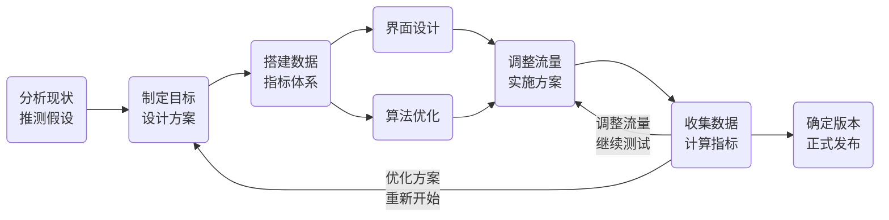

<!--more-->

# 双盲测试
将病人随机分为两组，病人在不知情的情况下分别服用安慰剂和测试用药，经过一段时间的实验后，比较两组病人的表现是否具有显著差异，以确定测试用药是否具有疗效。

# ABtest
AB测试

将Web或App界面或流程的两个或多个版本，在同一时间维度，分别让两个或多个属性或组成成分相同（相似）的访客群组访问，收集各群组的用户体验数据和业务数据，最后分析评估出最好版本正式采用。

一个简单的AB测试系统：
用户进入网站后，流量分配自同决定用户是否需要被进行AB测试，如果需要，流量分配系统会给用户打上在测试中属于什么分组的标签；然后用户浏览网页；用户在浏览网页时的行为都会被通过日志系统发回后台的日志数据库。

实验人员的工作：
1. 配置流量分配系统，决定满足什么条件的用户参加什么样的测试
2. 需要统计日志数据库中的数据，通过测评系统生成不同分组用户的实验报告，并比较和评测实验结果

## 测试要点
- 两个关键
   1. 同一时间维度
   2. 成分相同（相似）的访客群组
- 一个任务
   - 收集各群组的用户体验数据和业务数据
- 一个目标
   - 分析评估出最好版本正式采用

## 应用场景
ABtest的主要应用场景有两个：
1. 界面设计
   - 调整界面颜色
   - 调整按钮颜色
   - 调整界面外观
   - ……
2. 算法优化
 重点针对页面中现实的元素进行优化
   - 根据推荐算法向用户推荐一些高频搜索或关注的内容
   - 调整不同小版块的出现顺序或者所在位置，帮助用户在最短时间内到达自己需要的内容

## 测试流程
1. 分析实际业务场景，明确改进关键点，制定优化建议
2. 与项目经历确定优化目标，设计优化方案
3. 根据优化目标及方案搭建数据分析指标体系，明确数据口径
4. 由UI设计师或算法工程师根据方案完成样例开发，并设定数据埋点
5. 调整流量池，在同一时间内对目标用户进行测试
6. 根据时间进度及时收集数据，并根据数据情况调整流量池或重新进行测试
7. 经过多次试验取得成功后，确定新版本功能，正式发布

**灰度测试**：调整版本对企业影响极大，设定目标中的两个版本可能都不是有效版本，故不能将所有用户直接一分为二全部进行AB测试，对此可以采用灰度发布的方式——只选择其中极小部分用户AB测试，并逐步推广到所有用户。

## 注意事项
- AB测试需要分析参与测试用户的整体分布情况，而不仅是个别用户的情况
- 数据的有效性
  - 正常情况下，在推进AB测试时，前三天的数据波动会比较大，不建议直接使用
  - 一般进行AB测试需要大约7~14天为周期进行推进
  - 需要注意工作日与节假日影响的不同
- 若AB测试开始后用户反馈反方向发展：
  - 先缩小测试用的流量池，减少测试的用户数量
  - 同时分析目前的用户反馈情况，跟进反馈背后问题的真实原因，优化调整AB测试方案
  - 不要着急直接停止AB测试

## 样本量
- [AB测试样本量在线计算器](https://abtestguide.com/abtestsize/)
- [Evan's Awesome Sample Size Calculator](https://www.evanmiller.org/ab-testing/sample-size.html)

# 其他AB测试
## ABN test

## ANB test

# 多维测试
正常情况下，完成一个AB测试的整个周期为15天~1个月，这样一年内能完成的测试数目较为有限，为了保证高速迭代，可以在多个维度内同时推进AB测试
- 一定要保证任意两个维度互不影响

# 辛普森悖论
辛普森悖论[^1]（Simpson's Paradox）：在某个条件下的两组数据，分别讨论时都会满足某种性质，可是一旦合并考虑，可能导致相反的结论。

[^1]: 辛普森悖论为英国统计学家E.H.Simpson于1951年提出的悖论


## 性别歧视问题
假设一所高校只有两个学院（法学院和商学院），两个学院某年的考研录取情况如下：

<table border="1" class="dataframe">
  <thead>
    <tr style="text-align: center;">
      <th></th>
      <th colspan="2">法学院</th>
      <th colspan="2">商学院</th>
    </tr>
    <tr style="text-align: center;">
      <th></th>
      <th>男生</th>
      <th>女生</th>
      <th>男生</th>
      <th>女生</th>
    </tr>
  </thead>
  <tbody>
    <tr>
      <th>录取</th>
      <td>8</td>
      <td>51</td>
      <td>201</td>
      <td>92</td>
    </tr>
    <tr>
      <th>未录取</th>
      <td>45</td>
      <td>101</td>
      <td>50</td>
      <td>9</td>
    </tr>
    <tr>
      <th>录取率</th>
      <td>15.09%</td>
      <td>33.55%</td>
      <td>80.08%</td>
      <td>91.09%</td>
    </tr>
    <tr>
  </tbody>
</table>

单独看每个学院，都是女生的录取比例高于男生。但是如果看全校的录取情况：

||全校男生|全校女生|总人数|
|:---:|:----:|:----:|:---:|
|录取|209|143|352|
|未录取|95|110|205|
|总人数|304|253|557|
|录取率|68.75%|56.52%||

则会发现男生的录取比例高于女生。这就是辛普森悖论。


误区产生的原因主要在于——将“值与量”两个维度的数据，归纳成了“值”一个维度的数据，并进行了合并。

我们要避免辛普森悖论带来的误区，要斟酌个别分组的权重，以一定系数去消除分组资料基数差异带来的影响。

- 录取问题中，可以分学院进行考察。在辛普森悖论的案例中，需要考虑考察问题时使用的粒度级别。

> 《别拿相关当因果！》：要确定何时以及如何划分手中的数据，因为考察越来越细化的子数据集并不能解决所有问题。……要想找到作为区分条件的正确变量集，首先要对事件之间的因果结构有所了解。

在工作中，进行AB实验、AB实验评估之前，DS/DA需要和PM、运营确认好策略目的、策略细节，就是为了对策略中事件之间的因果结构有所了解，便于进行正确的数据划分、实验评估。

# 数据分析师的任务与职责
1. 针对业务场景，制定专题分析，明确分析目标
2. AB测试初期，分析业务场景，提出优化方向
3. 与产品经理沟通设计解决方案，制定数据分析体系，明确数据口径
   - 围绕核心目标，先行制定出最重要的指标
   - 指标体系需要由核心指标进行拆解，逐步到可落地实施
   - 在制定指标时，需要结合实际业务场景
   - 在明确指标的同时，明确取数的口径以及推算要求
4. 与测试人员明确流量分配情况，确保流量分配方式有效
5. 及时收集数据，分析并对测试过程不断优化
   - 加强注意数据的收集与整理，判断收集来的数据是否完整、能否支持分析
   - 对数据进行整理与分析，确定数据情况能否反映真实业务、与预期情况的匹配程度
   - 通过数据结果，判断是否需要对流量分配情况进行调整，是否需要加大测试量
   - 如果有一段时间的数据情况并不理想，找出真实原因并进行方案调整
   - 注意收集测试期间用户的反馈，为下一次测试提前做好准备
6. 跟进测试过程，了解测试用户的反馈情况，分析其他优化点
7. 完成测试后，撰写专题报告，整理测试方案、测试数据、测试报告等，完成文件归档
 需要归档的文件：
   - 测试启动会议记录
   - 测试方案研讨会会议记录
   - 测试实施方案及进度甘特图
   - 测试目标及数据指标体系
   - 测试过程数据集和数据口径
   - 测试最终总结报告
   - ……

# 问题
## 实验有提升，上线无变化
可能原因：
- 时效性
	- 模型往往是有时效性的
- 用户偏差
	- 实验时和实验后针对的人群不一定一样（eg：流量分流时是否过滤未登录的用户）
	- 未登录的用户没有用户相关的信息（缺失特征）——因此，有时候AB实验仅针对登录用户
	- 当模型全量上线时，可能会有大量未登录的流量混入，会影响模型整体的指标
- 大局影响
	- 可能单独看一个模块或某一个业务场景，指标确实有提升。但可能大局上某些领域之间存在竞争关系，一个变好了，会影响另一个的效果——上线后效果不明显，可能是其他业务上线了新功能，或者也做出了成绩，冲淡了效果
	- 搜索 & 推荐：推荐效果提升了，用户就会较少使用搜索；搜索的质量提升了，也可能会影响推荐的效果
- 系统原因
	- 如：新上的模块需要用的资源较多，导致服务端的请求经常来不及响应，走了兜底策略

## 有些指标提升，有些指标下降
- CTR（点击率）提升但CVR（转化率）下降了
	- 用户点击了更多的item，但用户潜在的购买力是固定的，所以转化率下降了
- Cart（加购）提升但Order（订单）下降

## 短期和长期的冲突
- 某些指标是越高越好吗？
- 转化率是越高越好吗？
	- 用户的消费力是有限的，现在多花了一些，未来可能就会少花一些
- 广告收入是越高越好吗？
	- 广告收入增加了，可能是向广告主的收费增加了→买广告的商家的收益可能就减少了→商家赚得少了→商家对平台的粘性降低→商家流失

# 实例
## 转化率

||A组|B组|
|:---:|:---:|:----:|
|转化率|$p_A$|$p_B$|
|用户数|$n_A$|$n_B$|

零假设为
$$H_0:p_A\leq p_B$$
备择假设为
$$H_1:p_A > p_B$$

则AB测试的$Z$值为
$$Z= \frac{ p_B - p_A }{ \sqrt{ \frac{ p_A (1 - p_A ) }{n_A}+\frac{ p_B ( 1 - p_B )}{ n_B }}}$$

# 其他

**题目**：项目上线要AB测试(测试CTR是否大于原来的CTR)，假设每天测试有10000人，现在我只统计里面1000人的CTR，问我要连续测试多少天，才能让得到的结论有95%的置信度？

**参考答案**：[SofaSofa-AB测试样本量的问题](http://24xi.org/sofasofa/forum_main_post.php?postid=1007525)
根据以下公式计算：
$$n = \frac{ \frac{ z^2 p ( 1-p ) }{ e^2 }}{ 1+ \frac{ z^2 p (1-p) }{ Ne^2 }}$$
其中
- $N$是样本总数，即10000
- $z$是标准正态分布的$95\%$置信区间
- $e$是边际误差，如1%
- $p$是CTR，如0.05

代入数值，求得$n\approx 1543>1000$，则只测一天得话，数据量不够。如果连续测两天，则样本总数为20000，此时计算得到$n\approx 1672<2000$。因此，测2天即可。


# 参考资料
- [数据分析师必知必会：AB测试项目复盘](https://mp.weixin.qq.com/s?__biz=MzUzODYwMDAzNA==&mid=2247490797&idx=3&sn=5eeb1eeac5facb704c77c21eb1c703a6&chksm=fad46be0cda3e2f6738947f9ce7dca4f60796870453d1222f51ba44cecbb321e0cbcaa881289&mpshare=1&scene=24&srcid=&sharer_sharetime=1589846450651&sharer_shareid=b539221659d6ecf12200314308b58dd3&key=e224f213fcbe84759f79aacb516d4bf8e8fa647879ab62d1eb6fd667e362e3ab352226749e8c5a94c9d72a3123286a45310529e7ab57c50dbece5f0296aa536ff328b1637c3af7f351a13bd2c7e76b00&ascene=14&uin=MjAwNDUzMjgxNw%3D%3D&devicetype=Windows+10+x64&version=62090070&lang=zh_CN&exportkey=AT3GI1XwfMzd87mEXW7wlLk%3D&pass_ticket=vCOnZ86B9zjbSGFnUl2pZh2C3sFfxo%2BAKXmGUdzX1teUg6KzXE86GrBP%2Fo1Z8BFC)
- [Speed vs. Certainty in A/B Testing](http://20bits.com/article/speed-vs-certainty-in-ab-testing)
- [Statistical Analysis and A/B Testing](http://20bits.com/article/statistical-analysis-and-ab-testing)
- [A/B Testing Tech Note: determining sample size](https://signalvnoise.com/posts/3004-ab-testing-tech-note-determining-sample-size)
- [How Not To Run an A/B Test](https://www.evanmiller.org/how-not-to-run-an-ab-test.html)
- [Simple Sequential A/B Testing](https://www.evanmiller.org/sequential-ab-testing.html)
- [数据分析必须警惕的坑：辛普森悖论](http://www.woshipm.com/data-analysis/1061642.html)
- [SofaSofa-AB测试样本量的问题](http://24xi.org/sofasofa/forum_main_post.php?postid=1007525)
- [做个ABtest还翻车了](https://mp.weixin.qq.com/s/_3_jU_-_utZp6bfxewf74Q)