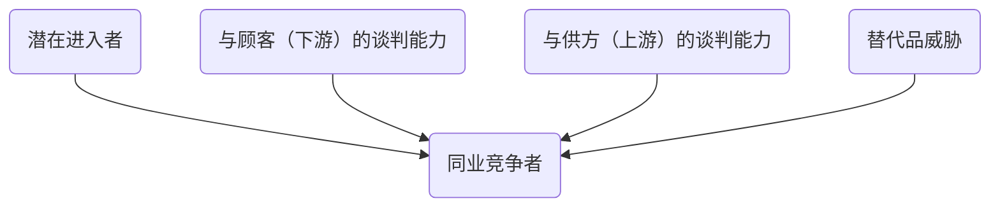

Michael Porter Five Forces Model

<!--more-->

# 波特五力模型
- 被广泛应用于很多行业的战略制定

Michael Porter于20世纪80年代初提出。他认为行业中存在着决定竞争规模和程度的五种力量，这五种力量综合起来影响着产业的吸引力以及现有企业的竞争战略决策。

这五种力量包括：
1. 同业竞争者的竞争程度（Rivalry）
2. 潜在新竞争者的进入（the threat of new entrants）
3. 潜在替代品的威胁（the threat of substitute offerings）
4. 供应商的议价能力（the bargaining power of suppliers）
5. 购买者的议价能力（the bargaining power of buyers）

## 同业竞争者
企业必须在市场、价格、质量、产量、功能、服务、研发等方面建立自己的核心竞争优势。

影响行业内企业竞争的因素有：
- 产业增加
- 固定成本/附加价值周期性生产过剩
- 产品差异
- 商标专有
- 转换成本
- 售后服务
- 集中与平衡
- 信息复杂性
- 竞争者的多样性
- 退出堡垒
- ……

意味着行业中现有企业之间竞争加剧的情况有：
- 行业进入障碍较低，势均力敌竞争对手较多，竞争参与者范围广泛
- 市场趋于成熟，产品需求增长缓慢
- 竞争者企图采用降价等手段促销
- 竞争者提供几乎相同的产品或服务，用户转换成本很低
- 退出障碍较高（退出竞争比继续参与竞争的代价更高）。退出障碍具体包括：
  - 资产的专用性
  - 退出的固定费用
  - 战略上的互相牵制
  - 情绪上的难以接受
  - 政府和社会的限制
  - ……

## 新进入者的威胁

影响潜在新竞争者进入的因素有：
- 经济规模
- 专卖产品的差别
- 商标转悠
- 资本需求
- 分销渠道
- 绝对成本优势
- 政府政策
- 行业内企业的预期反击
- ……

## 替代品的威胁

决定替代品威胁程度的因素：
- 替代品的相对价格表现
- 转换成本
- 客户对替代品的使用倾向

## 供应商的议价能力

决定供应商议价能力的因素有：
- 投入的差异
- 产品中供方和企业的转换成本
- 替代品投入的现状
- 供方的集中程度
- 批量大小对供方的重要性
- 与产业总购买量的相关成本
- 投入对成本和特色的影响
- 产业中企业前向整合相对于后向整合的威胁
- ……

## 购买者的议价能力
购买者主要通过压价与要求提供较高的产品或服务质量的能力，来影响行业中现有企业的盈利能力。

购买者议价能力主要取决于：
- 购买者的集中程度或业务量的大小
- 产品差异化程度与资产专用性程度
- 纵向一体化（后向整合能力）
  - 如果购买者实行了部分一体化或后向一体化的现实威胁，则在议价中购买者处于有利地位
- 购买者转换成本相对企业转换成本

一般来说，满足以下条件的购买者可能具有较强的议价能力：
- 购买者的总数较少，且每个购买者的购买量较大
- 卖方行业由大量的规模相对较小的企业组成
- 购买者所购买的主要是标准化产品，同时向多个供应商购买产品在经济上完全可行
- 购买者有能力实现后向一体化，而供应商不可能前向一体化

> - [前向一体化](https://baike.baidu.com/item/%E5%89%8D%E5%90%91%E4%B8%80%E4%BD%93%E5%8C%96/3216356?fr=aladdin)就是企业沿产业链向下游的用户方向扩展，即企业在被动接受用户委托进行快件传递的现有业务经营的基础上，向服务的应用层拓展，通过收购、自建、联合等方式进军网络购物市场，或与业有显著关联效应的出口导向型经贸企业和相关组织单位开展合作，根据市场需求，主动设计并向客户提供定制化、个性化的业务与延伸服务，以提高企业业务量并增加业务收入。实施前向一体化的一种有效方式是特许经营（franchising ）。

# 参考资料
- [百度百科-波特五力模型](https://baike.baidu.com/item/%E6%B3%A2%E7%89%B9%E4%BA%94%E5%8A%9B%E6%A8%A1%E5%9E%8B/9495965?fromtitle=%E6%B3%A2%E7%89%B9%E4%BA%94%E5%8A%9B&fromid=10805232&fr=aladdin)
- [如何进行波特五力分析？](https://zhuanlan.zhihu.com/p/134238096)
- [10大经典数据分析模型，你知道几个？](https://mp.weixin.qq.com/s?__biz=MzU5Mjg2OTQ1MA==&mid=2247485604&idx=1&sn=6132243e552196c5357f7be5661a2fbc&chksm=fe186981c96fe097090839cac38109670803301d3af2e6cb7e3aa1fb4dbe3643f5cdd1fc7a74&mpshare=1&scene=24&srcid=&sharer_sharetime=1589809278889&sharer_shareid=b539221659d6ecf12200314308b58dd3&key=61d9a55bd4b13250d9d9b72c926e31f3c963fa7004ed53af86ab53fe1f6b5801bf460986f5969cc4d9ddf3fd098c904d6f1b8f640c0d7aca9f572945246ccea42c22b5d804b881a7955b74528f2f0865&ascene=14&uin=MjAwNDUzMjgxNw%3D%3D&devicetype=Windows+10+x64&version=62090070&lang=zh_CN&exportkey=AYkajeOrvqQzbnEaJ%2BpPxfA%3D&pass_ticket=3hFOenbHRrI0XNiw95BJRgPjuKhLFRWJBVANkKsJrq9CYNi1R7fJlSrcHa4V3zgz)
- [购买者部分一体化或存在后向一体化](https://iask.sina.com.cn/b/bHe4XXEqVr1.html)