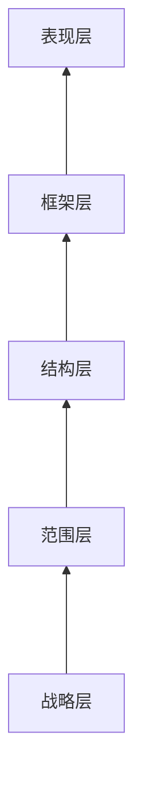

《用户体验要素》学习笔记

<!--more-->

# 用户体验
**用户体验**是指产品如何于外界产生联系并发挥作用
- 企业关注的是财务营收——投资收到的回报（return on investment）或投资回报率（ROI）
- 一个最常用的投资收益的度量标准是**转化率**（conversion rate）
 - 常用来衡量用户体验的效果
- 任何在用户体验上所做的努力，目的都是为了提高效率
 - 帮助用户工作得更快
 - 减少用户犯错的几率

# 五个层面

**自下而上**地建设，从抽象到具体

- 在“较高层面”中选择一个界限之外地选项，需要重新考虑“较低层面”中所做出地决策

## 战略层-产品目标和用户需求
strategy
网站的范围基本上是由网站战略层所决定的
- **产品目标**（product objectives）
 > 我们要通过这个产品得到什么？
- **用户需求**（user needs）
 > 我们的用户要通过这个产品得到什么？

需要**明确**产品目标和用户需求

### 产品目标
- 商业目标（business goals）、商业驱动因素（business drivers）
 - 替公司赚钱或替公司省钱
- 品牌识别（brand identity）
- 成功标准（success metrics）：一些可追踪的指标，在产品上线后用来显示它是否满足了我们自己的目标和用户的需求

### 用户需求
1. 用户是谁
2. 用户的需求是什么

#### 细分用户
- 通过**用户细分**（user segmentation）将大量的用户需求划分为几个可管理的部分
 - 每一群用户都是由具有某些共同关键特征的用户所组成
- 创建细分用户群只是一种用于“揭示用户最终需求的手段”

细分用户群的方法有很多：
1. 市场营销人员通常根据**人口统计学**（demographic）的标准来划分用户
 性别、年龄、教育水平、婚姻状况、收入等
2. **消费心态档案**（psychographic profile）用于描述用户对于世界，尤其是与我们的产品有关的某个事物的观点和看法的心理分析方法

#### 可用性和用户研究
用户研究（User Research）的**研究工具**：
- 用于收集用户的普遍观点与感知：
     - 问卷调查
     - 用户访谈
     - 焦点小组
- 用于理解具体的用户行为以及用户在和产品交互时的表现：
     - 用户测试
     - 现场调查

问卷调查和焦点小组属于**市场调研方法**（market research methods），是获取用户的基本信息的宝贵来源。

**现场调查**（contextual inquiry）：用于了解在日常生活情境中的用户行为。
- 通常应用于一个较小的范围
- 缺点：耗时、费用高

**用户测试**（user testing）：请用户帮忙测试产品。有时用于测试一个已完成的网站，也可以用于测试改版效果，或用于在网站发布之前发现可用性的问题，也可测试一个正在建造中的网站，甚至是一个粗略的低保真原型。

## 范围层-功能规格和内容需求
scope
结构层确定网站各种特性和功能最合适的组合方式，而这些特性和功能构成了网站的范围层

- 把用户需求和产品目标转变成产品应该提供给用户什么样的内容和功能

## 表现层
surface
一系列网页，由图片和文字组成

## 框架层
skeleton
按钮、控件、照片和文本区域的位置
- 用于优化设计布局，以达到这些元素的最大效果和效率
- 框架层确定了在结账页面上交互元素的位置
- 框架层定义了导航条上各要素的排列方式，允许用户可以浏览不同的商品分类

## 结构层
structure
- 框架是结构的具体表达方式
- 结构层用来设计用户如何到达某个页面，并且在他们做完事情之后能去什么地方
- 结构层确定哪些类别应该出现在哪里

# 参考资料
- [用户体验要素：以用户为中心的产品设计]()
